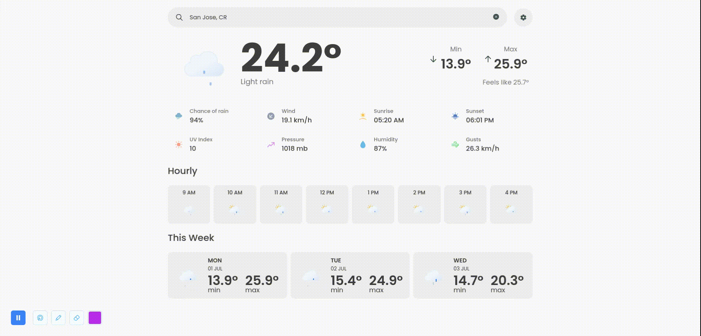
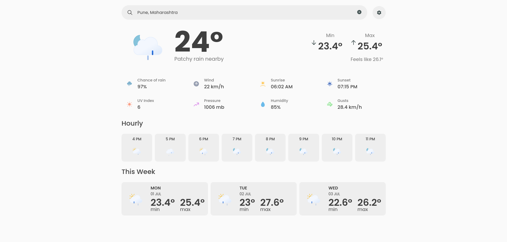
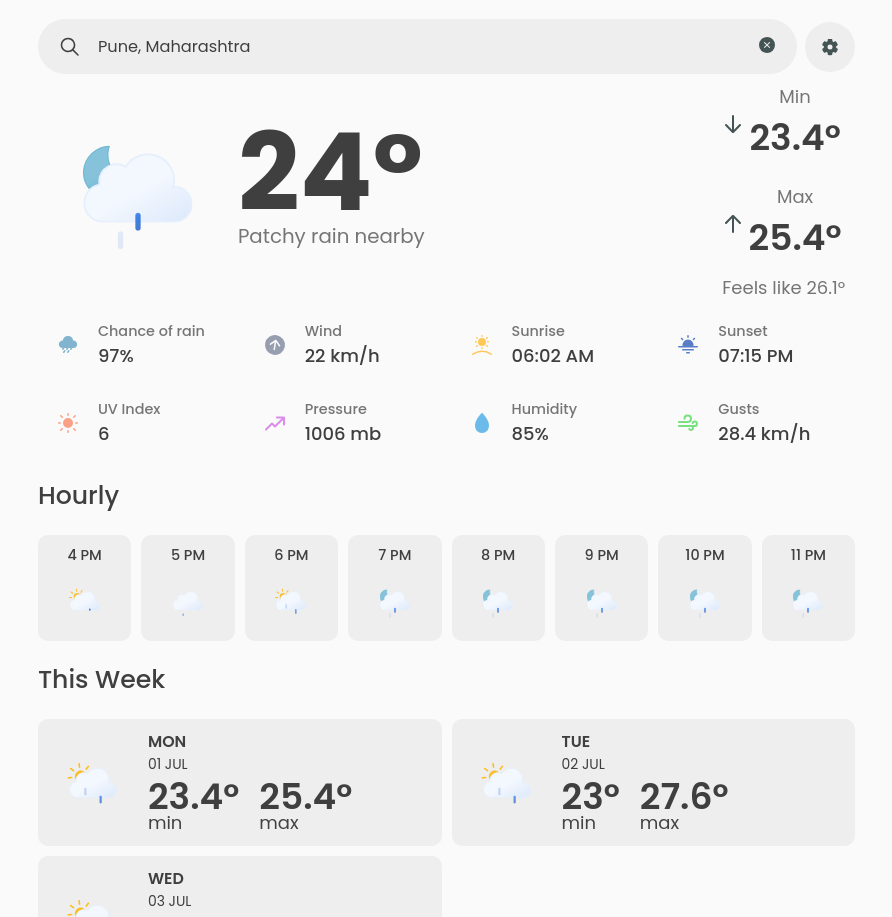
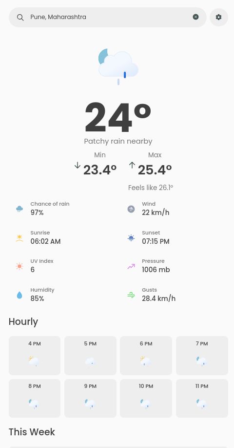

	<h1> Weather App
	 
		
		
		
		
		 
	</h1>
	<h3><b><a href="https://weather-app-dekateshantanu015.vercel.app/">View Live Demo</a></b></h3>

## Description

A minimal looking weather app using free API provided by Free Weather API - WeatherAPI.com.

## Built Using

- HTML5 
- CSS3 
- JavaScript 
- Webpack 

## Credits

#### JavaScript Libraries

- [date-fns](https://date-fns.org/)

## Gallery

#### Desktop view

#### Tablet view

#### Mobile view

